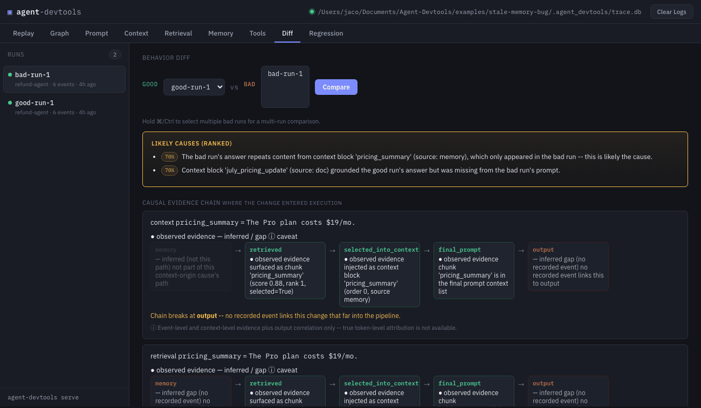
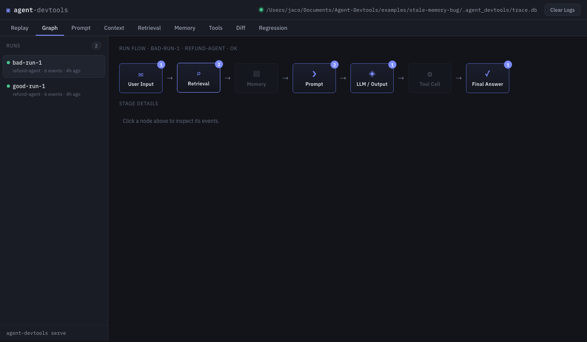
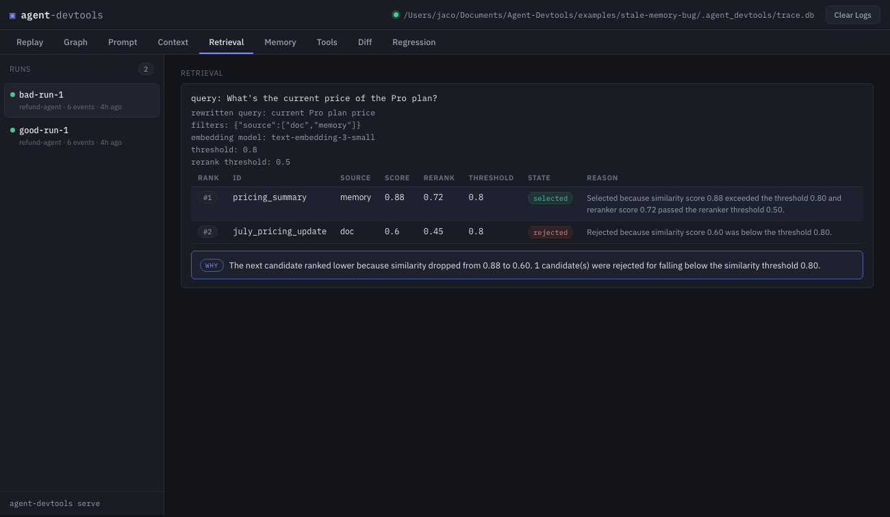
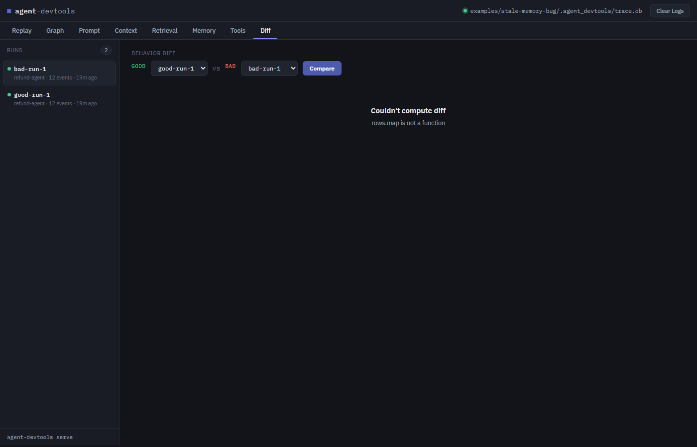

# Agent DevTools

**Chrome DevTools for AI agents.** A local-first, causal debugger that shows you *why* an AI agent behaved the way it did — not just what happened.

Most AI observability tools record what an agent did. Agent DevTools records the causal path: which memory influenced the answer, which retrieval candidate won, what context was injected, what prompt the LLM actually received, and what tools changed the output. Then it diffs a *good* run against a *bad* run and names the likely cause in plain language.



**Inspect what the agent saw · Compare good and bad runs · Replay and investigate failures.**

### See it in action






---

## The problem it solves

Your AI agent said something unexpected. Why?

- Which memory influenced the answer?
- Which retrieval candidate was selected, and why?
- Which tool call changed the output?
- What did the final assembled prompt actually contain?

Answering those questions today means merging trace logs, diffing JSON blobs by eye, and guessing. Agent DevTools replaces that with a local dashboard plus a diff engine that points you at the three lines of a trace worth reading closely.

**The core workflow:** instrument a run in a few lines of Python, then open the Dashboard to inspect it — or run the same agent twice (once good, once bad) and let the diff engine explain the divergence.

## Why this is different from an observability platform

It is **not** an observability platform. It does not compete with Langfuse, Phoenix, or hosted tracing products, and it does not provide aggregate latency/cost dashboards. Those answer *"is my system healthy on average."*

Agent DevTools answers a narrower question, well:

> Why did *this* run produce *this* output, and what's different about the run that didn't?

To answer that, it captures the one thing generic trace pipelines usually lose: **the exact final prompt, with each context block tagged by its provenance** (memory, doc, tool result, etc.). It is local-first — everything stays in an append-only SQLite file on your machine.

---

## Installation

Requires Python ≥ 3.9.

```bash
# From PyPI (base package: FastAPI server + SQLite store)
pip install agent-devtools

# With optional integrations
pip install "agent-devtools[langchain]"   # LangChain callback handler
pip install "agent-devtools[groq]"        # Groq LLM tracing (includes langchain-core)

# Or install from this repository
pip install -e packages/python-sdk
```

## Fastest possible demo (no API key, no network)

```bash
pip install -e packages/python-sdk   # or: pip install agent-devtools
python examples/quickstart.py
```

That's it. When the run block closes, the Dashboard server starts in a background thread and opens in your browser automatically — no API key, no framework, no separate `serve` step.

The whole example is four executable lines:

```python
from agent_devtools import trace

with trace.run("quickstart-agent", auto_open=True) as run:
    run.input("Update my shipping address to Rome")
    run.memory_write("address", "Milan")  # Bug: incorrect state mutation
    run.output("Updated your address to Milan!")
```

Open the **Replay** or **Memory** tab: the user asked to update the address to **Rome**, but a buggy memory write stored **Milan**. Bug found, in seconds.

## Live demo with a real LLM (Groq)

```bash
pip install "agent-devtools[groq]"
export GROQ_API_KEY="your_groq_key"
python demo.py
```

`demo.py` starts the Dashboard, opens your browser, and runs an interactive chat loop against Groq's `llama-3.3-70b-versatile` with a small traced in-memory memory store. Every message, memory read, context block, prompt, and model response is recorded live at `http://127.0.0.1:4173`.

---

## Core SDK usage

The primary ingestion path is **manual, explicit instrumentation** from inside agent code. No trace export step, no adapter to write first.

### Manual instrumentation with `trace.run`

```python
from agent_devtools import trace

with trace.run("refund-agent") as run:
    run.input(user_message)
    run.retrieval(query, results)
    run.context_block(source="memory", key="pricing", content=text)
    run.prompt(system=system_prompt, messages=messages)
    run.tool_call(name="lookup_price", args={"plan": "pro"}, result={"price": "$29/mo"})
    run.memory_write(key="last_price", value="29.99")
    run.output(response_text)
```

Every method on the `run` handle logs one typed event into the local store:

| Method | Event type | Purpose |
|---|---|---|
| `run.input(msg)` | `user.input` | The user's message |
| `run.retrieval(query, results)` | `retrieval.query` + `retrieval.result` | Retrieval candidates with scores/ranks |
| `run.context_block(source, content, key, order)` | `context.block` | One injected context block, tagged by provenance |
| `run.prompt(system, messages, context)` | `prompt.assembled` | The final assembled model input |
| `run.tool_call(name, args, result, error)` | `tool.call` + `tool.result` | Tool invocations, outputs, and errors |
| `run.memory_read / write / update / delete` | `memory.*` | The memory lifecycle |
| `run.state_snapshot(state)` | `state.snapshot` | Any agent/channel state |
| `run.output(response)` | `model.response` | The final (or intermediate) model output |
| `run.assert_that(name, passed, details)` | `assertion.passed` / `assertion.failed` | In-run debug assertions for CI |

The `run` block sets the run status to `ok` or `error` automatically, whether the block succeeds, raises, or ends normally.

To see the Dashboard on run close, pass `auto_open=True`:

```python
with trace.run("my-agent", auto_open=True) as run:
    ...
```

Or control the server explicitly:

```python
trace.serve()      # start the server (background thread) + open the browser
trace.open_ui()    # open the browser against an already-running server
```

### Zero-config entry point: `AgentDebugger`

```python
from agent_devtools import AgentDebugger

debugger = AgentDebugger()          # defaults: http://127.0.0.1:4173
debugger.start()                    # starts the server + opens the browser

with debugger.run("my-agent") as run:
    run.input("Hello")
    ...
```

`AgentDebugger` owns the store and the server lifecycle, and also provides `create_groq_llm(...)` and `wrap_groq(...)` for traced Groq models (see Integrations).

---

## Dashboard

The Dashboard is a static web UI served by the local debug server at `http://127.0.0.1:4173`. It polls the API every 4 seconds and lists runs on the left.

| Tab | What it shows |
|---|---|
| **Replay** | The full run, step by step, in event order — plus **Deterministic Replay**: re-execute the recorded events in isolation and get a `completed` / `diverged` / `failed` report with divergence evidence |
| **Graph** | A visual flow of the run: Input → Retrieval → Memory → Prompt → LLM → Tools → Final Answer, with per-stage event counts. Click a node to inspect its events |
| **Prompt** | The exact final assembled prompt the LLM saw, including system message and context references |
| **Context** | Every injected context block, in injection order, tagged with its source (memory, doc, ...) |
| **Retrieval** | Candidates with ranks, scores, reranker scores, thresholds, selected/rejected state, and a human-readable reason for every decision |
| **Memory** | The full memory lifecycle: reads, writes, updates, deletes, and state snapshots |
| **Tools** | Every tool call: name, args, result, and errors |
| **Diff** | Good run vs bad run → likely cause, with a side-by-side memory chunk diff |


## Debugging capabilities

### Behavior Diff — compare a good run and a bad run

The signature feature. `diff_runs(store, run_a, run_b)` compares a *good* (baseline) run against a *bad* (candidate) run across seven sections — input, retrieval, context blocks, assembled prompt, tools, memory, and output — and produces:

- **`narrative`**: a plain-language list of what changed ("Chunk 'pricing_summary' was newly selected for the final prompt in the bad run.")
- **`likely_causes`**: heuristic causal callouts. When a changed context or memory value shows up verbatim (or as a matching numeric token, e.g. a stale price) in the bad run's answer but not the good run's, it is flagged as the likely cause.
- **`scored_causes`**: the same likely causes, each with a heuristic confidence score (0.0–1.0) so the UI can rank them. Verbatim matches score 1.0; shared salient numeric tokens (e.g. a stale price) score 0.7.
- **`sections`**: structured per-section details for the UI. The `prompt` section now includes a `token_diff` — a token-level diff of the flattened prompt (system + messages) so you can see exactly which tokens were added, removed, or replaced between runs.

```python
from agent_devtools import TraceStore, diff_runs

store = TraceStore()
result = diff_runs(store, "good-run-1", "bad-run-1")
for cause in result.scored_causes:
    print(f"[{cause['confidence']:.0%}] {cause['message']}")
```

### Multi-run comparison

`diff_runs_multi(store, baseline, candidates)` compares a baseline (good) run against multiple candidate (bad) runs and returns:

- **`comparisons`**: one full diff result per candidate
- **`common_causes`**: likely causes that appear in *every* candidate comparison — the strongest signal that a single root cause explains all the bad runs

```python
from agent_devtools import TraceStore, diff_runs_multi

store = TraceStore()
result = diff_runs_multi(store, "good-run-1", ["bad-run-1", "bad-run-2"])
for cause in result["common_causes"]:
    print("root cause across all candidates:", cause)
```

The Diff UI tab supports multi-run comparison: hold ⌘/Ctrl and select multiple bad runs in the "bad" dropdown.

The Diff UI tab renders the result, and the **Diff tab → "Chunks" section** shows a side-by-side table of every retrieved chunk that changed:

| Status | Meaning |
|---|---|
| `newly selected` / `deselected` | Chunk was selected for the final prompt only in one run |
| `rank changed` | Same chunk moved rank (e.g. #7 → #1) |
| `score changed` | Retrieval/reranker score moved, with the Δ score |
| `newly retrieved` / `removed` | Chunk appeared / disappeared between runs |
| replacement callout | "Chunk A replaced Chunk B in the final prompt" |



This is intentionally a heuristic, not a proof — it points you at the right lines of a trace instead of making you diff two JSON blobs by hand.

### Retrieval Explanation — why each candidate was selected or rejected

For every retrieval call, `explain_retrieval(events)` turns raw numbers into plain-language reasons:

> Selected because similarity score 0.91 exceeded the threshold 0.80.
> Rejected because similarity score 0.52 was below the threshold 0.80.
> This chunk was excluded because metadata filters removed it.
> Selected despite similarity score 0.75 being below the threshold 0.80 because the reranker score 0.85 passed the reranker threshold 0.50.

To enrich retrieval traces, pass query metadata to `run.retrieval(...)`:

```python
run.retrieval(
    query=user_question,
    results=results,
    rewritten_query="current Pro plan price",        # after query rewriting
    filters={"source": ["doc", "memory"]},           # metadata filters applied
    embedding_model="text-embedding-3-small",        # embedding model used
    threshold=0.80,                                  # similarity cutoff
    rerank_threshold=0.50,                           # reranker cutoff
)
```

Per-result fields can override query-level settings: `score`, `rank`, `selected`, `filtered`, `threshold`, `rerank_score` (or `reranker_score`), `rerank_threshold`, and a custom `reason`.

The Retrieval tab renders the explanation summary, query metadata, and a per-candidate table with reasons.


### Memory debugging

Memory events (`memory.read / write / update / delete`) are stored append-only. The **Memory** tab shows the lifecycle in order; the diff engine derives a *"final value per key"* view for each run and reports which keys differed. This is the view that catches stale-memory bugs (see the Atlas example below).

### Prompt & context inspection

`run.prompt(...)` records the exact final input the model saw — system prompt, messages, and context references. `run.context_block(...)` tags each injected chunk with where it came from and its injection order. The **Prompt** and **Context** tabs render these directly; the diff engine uses them to detect context swaps, reordering, and value changes between runs.

### Tool-call inspection

`run.tool_call(name, args, result, error)` records every invocation. The **Tools** tab shows calls, arguments, outputs, and errors; the diff engine highlights tools that returned different data between runs.

### Regression / CI debugging ("fixture replay")

Two related mechanisms:

1. **In-run assertions** — `run.assert_that(name, passed, details)` logs an `assertion.passed` or `assertion.failed` event:

   ```python
   run.assert_that("no stale pricing mentioned", "$19" not in answer,
                   details="answer must not reference the pre-July price")
   ```

2. **`agent-devtools test` CLI** — replays fixture JSON files and fails (exit code 1) if any run contains an `assertion.failed` event:

   ```bash
   agent-devtools test fixtures/*.json
   ```

   The fixture format (`agent-devtools/fixture@1`) is a portable export of a run's events, produced by `TraceStore.export_fixture()` or the `/api/runs/{run_id}/fixture` endpoint. **Note:** the command is implemented, but this repository does not currently ship any example fixture files — you generate them from your own runs.

#### Regression analysis tab — N-run regression scan

The **Regression** tab compares one baseline (good) run against many candidate
(bad) runs at once and ranks the findings. For each candidate it runs the same
diff engine used by the two-run Diff tab, then labels the candidate
`regression` / `suspicious` / `normal` from concrete evidence:

- scored likely causes (the same heuristic callouts as Behavior Diff),
- the causal evidence chain showing where the behavior changed,
- scope mismatches and stale memory, retrieved after the run,
- retrieval denials (permission-rejected results).

Pick a baseline, multi-select one or more candidates, and click **Run regression
scan**. Each finding shows a one-line signal, the changed output (when
applicable), and **→ Diff vs baseline** / **→ Replay** links that jump straight
into the existing Diff and Replay workflows, so the tab is a triage surface —
not a replacement for them.

```python
from agent_devtools import trace

with trace.run("good") as good:
    ...  # known-good behavior

with trace.run("bad") as bad:
    ...  # the behavior you want to root-cause
```

Then open the Dashboard, go to the **Regression** tab, set the good run as the
baseline and the bad run as a candidate.

### Deterministic Replay — is this run self-consistent?

Click **Run Deterministic Replay** in the **Replay** tab (or call
`POST /api/runs/{run_id}/replay`) and Agent DevTools re-executes the run's
recorded event log in isolation — no network, no LLM, no user code — then
returns a `ReplayReport` with one of three statuses:

| Status | Meaning |
|---|---|
| **completed** | Every recorded event is internally consistent. A deterministic re-run with the same inputs would reproduce the exact event chain. |
| **diverged** | The recorded log contradicts itself, and the report names the exact event where determinism broke with a *divergence evidence* entry (expected vs. actual). |
| **failed** | The run recorded a failure — a debug `assertion.failed` or a run that ended with status `error`. |

The deterministic checks are the parts of a run that are fully determined by
its own events:

- **Memory lifecycle** — `memory.write` / `memory.update` / `memory.delete`
  are replayed onto a fresh store; each `memory.read` and `memory.update`
  `old_value` is checked against the replayed chain. A read that returns a
  value the write chain never wrote (e.g. a **stale memory** bug) is reported
  as `memory.read.stale` divergence.
- **Retrieval** — candidate ranks are re-derived from scores and the selected
  set is checked for score monotonicity; a rank flip or a selected candidate
  scoring below a rejected one is reported (`retrieval.rank`,
  `retrieval.selection`).
- **Tools** — every `tool.call` must be matched by a `tool.result` /
  `tool.error`; unmatched calls are reported as notes.
- **CI debug assertions** — `assertion.passed` / `assertion.failed` are
  replayed; a failed assertion marks the report **failed**.

Replay reports are persisted against the run and listed in the **Replay
history** pane, so you can see how the answer and the evidence evolved across
replays. This is distinct from the framework-level graph replay in the Atlas
example (`verify_traces.py --replay`), which re-runs the agent's actual code;
deterministic replay works on *any* recorded run with no agent code.


---

## Supported integrations

### LangChain

`LangChainTraceHandler` is a `BaseCallbackHandler` that bridges LangChain's callback events into the append-only store.

```python
from agent_devtools import trace
from agent_devtools.adapters import LangChainTraceHandler

with trace.run("my-agent") as run:
    handler = LangChainTraceHandler(run=run)
    chain.invoke({"question": "..."}, config={"callbacks": [handler]})
```

Or standalone — the handler creates and finishes its own run:

```python
handler = LangChainTraceHandler(agent_name="my-agent")
chain.invoke({"question": "..."}, config={"callbacks": [handler]})
```

Event mapping:

| LangChain callback | agent-devtools event |
|---|---|
| `on_chain_start` (root) | `user.input` |
| `on_chain_end` (root) | `model.response` |
| `on_llm_start` / `on_chat_model_start` | `prompt.assembled` |
| `on_llm_end` | `model.response` |
| `on_tool_start` | `tool.call` |
| `on_tool_end` | `tool.result` |
| `on_retriever_start` | `retrieval.query` |
| `on_retriever_end` | `retrieval.result` |

Error events (`chain.error`, `model.error`, `tool.error`, `retrieval.error`) are recorded by the corresponding `on_*_error` callbacks.

### Groq

`TracedGroq` wraps a `langchain_groq.ChatGroq` so every `invoke` / `ainvoke` / `batch` / `abatch` / `stream` / `astream` call is automatically traced. It reuses `LangChainTraceHandler` for the model-call tracing and additionally manages run lifecycle for bare model invocations.

```python
from agent_devtools import AgentDebugger

debugger = AgentDebugger()
debugger.start()

llm = debugger.create_groq_llm()   # traced ChatGroq, llama-3.3-70b-versatile

with debugger.run("groq-agent") as run:
    run.input("Hello")
    answer = llm.invoke("Hello")
    run.output(answer.content)
```

Requires `langchain-groq` (`pip install "agent-devtools[groq]"`) and a `GROQ_API_KEY` (env var or `groq_api_key=...`). Missing key raises `GroqApiKeyError` after printing setup instructions (free key at console.groq.com). `wrap_groq(llm, debugger)` wraps an existing compatible chat model; calls made outside an active `debugger.run()` block create and finish their own run. Any attribute not overridden (e.g. `bind_tools`, `with_structured_output`) is delegated to the underlying model.

### AgentShield

`AgentShield` provides real-time financial guardrails and spend control for AI agents. `agent-devtools` integrates directly with AgentShield's `SpendEvaluationEmitter` (v1 schema) to log policy evaluations, spend limits, and block events into your trace store.

#### In-process callback usage

Pass `make_agentshield_callback(store)` directly to AgentShield's emitter:

```python
from agentshield import SpendControlEngine, SpendEvaluationEmitter
from agent_devtools import TraceStore
from agent_devtools.adapters.agentshield import make_agentshield_callback

store = TraceStore()
cb = make_agentshield_callback(store)

engine = SpendControlEngine()
emitter = SpendEvaluationEmitter(engine, on_event=cb)

# Evaluate transaction; blocked/passed events automatically flow into TraceStore
decision = emitter.evaluate_with_trace(
    transaction={"amount": "500.00", "merchant": "openai-api", "category": "llm_inference"},
    rules=[{"id": "r1", "type": "transaction_limit", "limit": "250.00"}],
    trace_id="trace_42"
)
```

#### NDJSON file ingestion

For log-file tailing or asynchronous execution pipelines:

```python
from agent_devtools import TraceStore
from agent_devtools.adapters.agentshield import ingest_ndjson_file

store = TraceStore()
ingest_ndjson_file(store, "path/to/agentshield.ndjson")
```

#### Event mapping

AgentShield's `trace_id` maps directly to `agent-devtools`'s native `run_id`:

| AgentShield field | agent-devtools event | Purpose |
|---|---|---|
| `agentshield.spend.evaluation` | `event_type` | Spend policy evaluation event |
| `trace_id` | `run_id` | Joins spend evaluations directly to execution traces |
| `transaction` | `payload.transaction` | Transaction details (amount, merchant, category) |
| `decision` | `payload.decision` | Authoritative outcome (`ALLOWED`, `BLOCKED`, rule triggered) |
| `evaluation` | `payload.evaluation` | Per-rule trace (triggered/passed/skipped, actual vs threshold) |


---

## CLI

The `agent-devtools` command line:

```bash
agent-devtools serve [--db PATH] [--host HOST] [--port PORT]
```

Starts the local debug server (FastAPI + static UI) against the trace database. Defaults: `127.0.0.1:4173`, and the database in `.agent_devtools/trace.db` (found by walking up/down from the current directory, or pointed at via `AGENT_DEVTOOLS_DB` or `--db`).

```bash
agent-devtools test FIXTURE_GLOB...
```

Plays fixture JSON files into an in-memory store and fails (exit code 1) on any run containing an `assertion.failed` event. As noted above, no fixtures are shipped in this repo yet.

---

## HTTP API

The local debug server exposes a small REST API over the same SQLite file the SDK writes to. All routes are under `/api`.

| Method | Path | Description |
|---|---|---|
| GET | `/api/health` | Server status + DB path |
| GET | `/api/runs` | List runs (with event counts) |
| DELETE | `/api/runs` | Delete all runs and events |
| GET | `/api/runs/{run_id}` | Run metadata + full event list |
| DELETE | `/api/runs/{run_id}` | Delete one run and its events |
| GET | `/api/runs/{run_id}/prompt` | Final assembled prompt |
| GET | `/api/runs/{run_id}/context` | Injected context blocks |
| GET | `/api/runs/{run_id}/retrieval` | Raw retrieval query/result events |
| GET | `/api/runs/{run_id}/retrieval/explain` | Structured retrieval explanations |
| GET | `/api/runs/{run_id}/memory` | Memory lifecycle events |
| GET | `/api/runs/{run_id}/tools` | Tool call/result events |
| GET | `/api/runs/{run_id}/assertions` | Assertion pass/fail events |
| GET | `/api/runs/{run_id}/fixture` | Export run as a portable fixture JSON |
| POST | `/api/runs/{run_id}/replay` | Run a deterministic replay; persists and returns a `ReplayReport` |
| GET | `/api/runs/{run_id}/replays` | List replay reports for a run (id, status, summary, time) |
| GET | `/api/runs/{run_id}/replay/{replay_id}/report` | Full `ReplayReport` (steps + divergence evidence) for one replay |
| GET | `/api/diff?a={run_a}&b={run_b}` | Behavior diff: sections, narrative, likely_causes, scored_causes, token_diff |
| GET | `/api/diff/multi?baseline={run}&candidates={a,b,...}` | Multi-run diff: per-candidate diffs + common root causes |

Example:

```bash
curl "http://127.0.0.1:4173/api/diff?a=good-run-1&b=bad-run-1"
```

This is a local read-only debug server, **not** a telemetry backend. It is designed to run on your machine (binds `127.0.0.1` by default) with no authentication.

---

## Event model

Everything is one flat, append-only stream of typed events per run, stored in SQLite (`runs` + `events` tables):

```
user.input · retrieval.query · retrieval.result · context.block
prompt.assembled · tool.call · tool.result
memory.read · memory.write · memory.update · memory.delete
state.snapshot · model.response · assertion.passed · assertion.failed
```

The LangChain adapter additionally emits `chain.error`, `model.error`, `tool.error`, and `retrieval.error` for failed callbacks.

Every UI tab and the diff engine is a **derived view computed at read time** over this log — nothing is normalized away, and nothing is thrown away. The schema at `schemas/event.schema.json` documents the portable fixture format (`agent-devtools/fixture@1`) used for export/import.

---

## Examples

| Example | What it demonstrates |
|---|---|
| `examples/quickstart.py` | The 5-line zero-config quickstart; Dashboard auto-opens on run close |
| `examples/stale-memory-bug/` | `good_run.py` + `bad_run.py`: same agent, same question, stale-memory retrieves differently. Open the Diff tab to see the rank flip, context swap, and likely-cause callout |
| `examples/langchain-integration/` | Builds a LangChain chain (retriever → prompt → fake model → tool) traced with `LangChainTraceHandler`; `verify_traces.py` checks the SQLite store |
| `examples/langgraph-memory-agent/` | **Atlas**: a full LangGraph billing agent (`StateGraph` with nodes, conditional routing, retriever, tool, persistent memory) containing one intentional stale-memory bug. Run `run_session.py --mode fresh` and `--mode stale`, then compare in the Diff tab. `verify_traces.py` verifies the traces, prints the diff and retrieval explanations, and can deterministically replay the graph (no API key, fully reproducible) |
| `demo.py` | Interactive Groq chat demo with memory tracing and auto-opened Dashboard |

---

## Architecture

```
.
├── packages/python-sdk/
│   └── agent_devtools/
│       ├── __init__.py       # public API surface, version 0.3.0
│       ├── trace.py          # trace.run() context manager + Run handle
│       ├── store.py          # append-only SQLite trace store
│       ├── diff.py           # Behavior Diff engine (sections/narrative/likely causes)
│       ├── explain.py        # Retrieval Explanation engine
│       ├── replay.py         # Deterministic Replay engine (completed/diverged/failed + ReplayReport)
│       ├── redaction.py      # best-effort secret redaction before persistence
│       ├── cli.py            # agent-devtools serve / test
│       ├── debugger.py       # AgentDebugger zero-config entry point
│       ├── adapters/         # LangChainTraceHandler, TracedGroq
│       └── server/           # FastAPI debug server + static UI (Replay/Graph/Prompt/Context/Retrieval/Memory/Tools/Diff)
├── examples/                 # quickstart, stale-memory-bug, langchain-integration, langgraph-memory-agent
├── schemas/
│   └── event.schema.json     # portable fixture format (agent-devtools/fixture@1)
├── assets/                   # dashboard screenshots
├── docs/vision.md            # design intent: a debugger, not a dashboard
├── demo.py                   # live Groq demo
└── test_*.py                 # end-to-end verification scripts (trace E2E, Groq integration, TracedGroq mock)
```

Core design principle (from `docs/vision.md`): store raw debug events append-only, and derive all views (memory, retrieval, prompt, tools, comparison) at read time. This keeps framework-specific detail intact instead of forcing every event into one rigid shape up front.

---

## Current limitations

- **In-development, version 0.3.0.** The SDK, diff engine, and UI are functional and tested, but the API may change.
- **`agent-devtools test` has no shipped fixtures.** The command is implemented and works, but this repository ships no example fixture files.
- **`AgentDebugger.stop()` is a no-op for the server thread.** It clears the internal "started" flag, but the background Uvicorn thread (a daemon) is only actually terminated when the process exits.
- **Redaction is best-effort, not a security boundary.** `redact()` masks obvious secrets (API keys, tokens, passwords) by key name and common `sk-...` shapes before events are written to disk, but it is a courtesy, not a guarantee.
- **Behavior Diff is heuristic.** The likely-cause callouts are deliberately heuristic, not proof.
- **The server has no authentication.** It binds `127.0.0.1` by default and is meant for local debugging.
- **`schemas/event.schema.json` lists event types the SDK does not yet emit** (`run.started`, `model.request`, `run.finished`) — the schema is slightly ahead of the implementation; the SDK emits the event types documented in the Event model section above.
- **No multi-machine / hosted mode.** Data lives in a local SQLite file.

---

## Roadmap

Planned, not yet implemented:

- Dedicated adapters for LangGraph, OpenAI Agents SDK, CrewAI, LlamaIndex (note: the Atlas *example* uses LangGraph with manual instrumentation — there is no LangGraph adapter module yet)
- Langfuse / Phoenix trace bridge
- JS/TS SDK
- Hosted / Postgres mode

---

## License

MIT. See `LICENSE`.