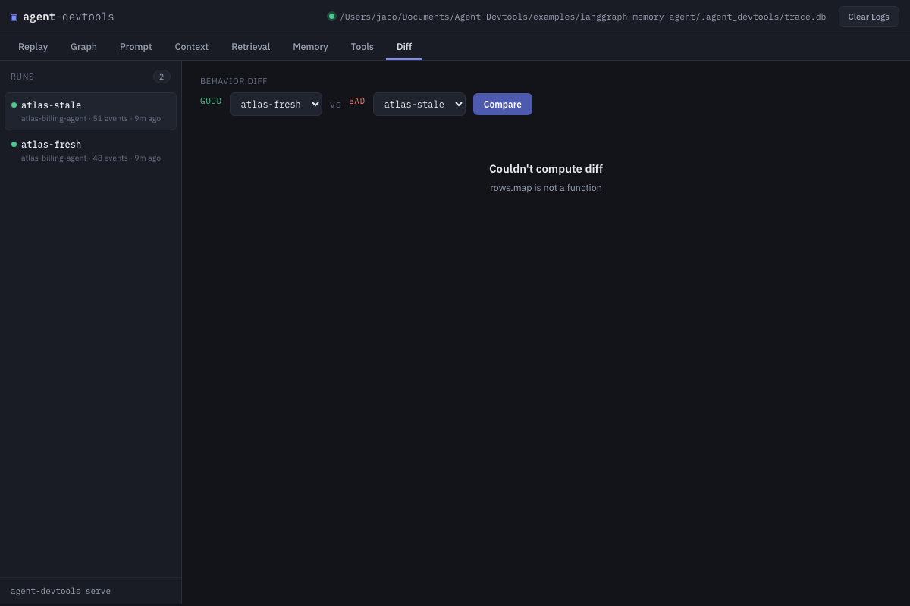
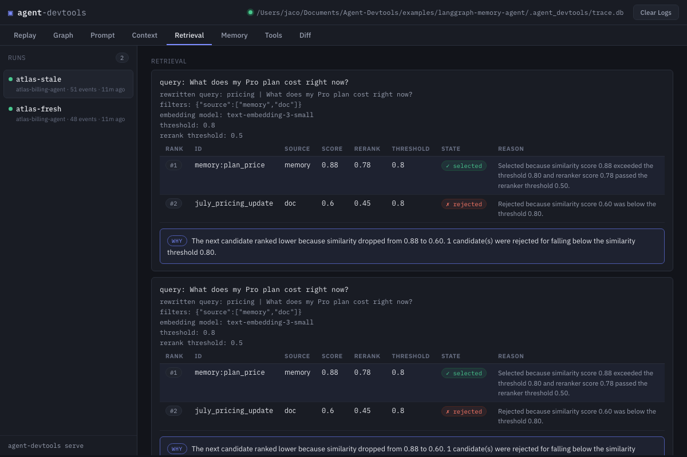
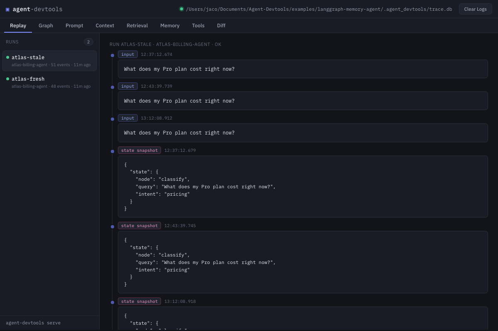

# Atlas: a real bug, found in 5 minutes

**Your agent just told a customer the wrong price. Why?**

This example reproduces a real production incident — a LangGraph billing agent
quotes `$19/mo` when the customer was billed `$29` — and shows you exactly how
to find the root cause with Agent DevTools. No API keys, no network, no
guessing. Just two runs and a diff.



---

## Why should you care?

If you've ever debugged an AI agent, you know the pain: the final answer is
wrong, but *nothing* tells you why. Was it the retriever? The memory? The
prompt? A tool?

Agent DevTools answers that question. It records every step of a run —
retrieval, memory reads, context injection, the assembled prompt, tool calls —
then **diffs two runs** to surface the likely cause in plain language.

This example is the fastest way to see it work. It's a real `StateGraph` with
nodes, conditional routing, a hybrid retriever, persistent memory, and a tool —
and it contains **one intentional bug** that's invisible if you only look at
the final token.

---

## Try it in under 5 minutes

```bash
# 1. Install the SDK (from repo root)
python3 -m pip install -e packages/python-sdk

# 2. Reproduce the incident — same agent, same question, two memory states
cd examples/langgraph-memory-agent
python3 run_session.py --mode fresh --run-id atlas-fresh
python3 run_session.py --mode stale --run-id atlas-stale
```

You'll see the incident happen live:

```
[atlas-fresh] mode=fresh
  question: What does my Pro plan cost right now?
  answer:   Your Pro plan costs $29/mo as of July 1st.

[atlas-stale] mode=stale
  question: What does my Pro plan cost right now?
  answer:   Your Pro plan costs $19/mo.      <-- the incident
```

Same agent. Same question. One answers correctly, the other quotes a stale
price. Every event from both runs is now in the local trace store.

```bash
# 3. Open the debugger
agent-devtools serve
```

Open `http://127.0.0.1:4173`. That's it — you're debugging.

---

## Find the bug in 30 seconds

Open the **Diff** tab. Select `atlas-fresh` as *good* and `atlas-stale` as
*bad*, then **Compare**. Agent DevTools computes a plain-language behavior diff
and names the likely causes:

> **Likely causes**
>
> - The bad run's answer repeats content from context block `memory:plan_price`
>   (source: memory), which only appeared in the bad run – this is likely the cause.
> - Context block `july_pricing_update` (source: doc) grounded the good run's answer
>   but was missing from the bad run's prompt.
> - The bad run's answer repeats memory value `plan_price` = `$19/mo`,
>   which differed from the good run – this is likely the cause.

The bug is upstream of the model: **the retriever ranked a stale memory above
the authoritative document, and the model answered from whatever context it
was given.**



The **Retrieval** tab explains *why* each candidate was selected or rejected,
not just the scores:

| Rank | Id                  | Source   | Score | Rerank | Threshold | State      | Reason |
|------|---------------------|----------|-------|--------|-----------|------------|--------|
| 1    | memory:plan_price   | memory   | 0.88  | 0.78   | 0.80      | ✓ selected | Selected because similarity score 0.88 exceeded the threshold 0.80. |
| 2    | july_pricing_update | doc      | 0.60  | 0.45   | 0.80      | ✗ rejected | Rejected because similarity score 0.60 was below the threshold 0.80. |

The memory candidate scored higher than the document (0.88 vs 0.60) purely
because of a frequency boost — even though the document is the *source of
truth*. That's the root cause, made visible.



The **Replay** tab shows the full event timeline of the buggy run:
`user.input` → `retrieval.query` → `retrieval.result` → `memory.read` →
`memory.write` → `context.block` → `prompt.assembled` → `model.response` →
`tool.call` → `tool.result`. That's the causal story of the incident, in order.

---

## What you just saw

| Tab | What it shows |
|---|---|
| **Replay** | The full run, step by step |
| **Prompt** | The exact final prompt the LLM saw |
| **Context** | Every context block, tagged by provenance |
| **Retrieval** | Candidates with scores, thresholds, filters, and a human-readable reason for every selection |
| **Memory** | The full memory lifecycle |
| **Tools** | Every call, args, and result |
| **Diff** | Good run vs bad run → likely cause, with a side-by-side memory chunk diff |

**Local-first.** Everything stays in an append-only SQLite log
(`.agent_devtools/trace.db`). Nothing leaves your machine.

**Deterministic.** The graph never hits the network, so both runs are 100%
reproducible — you can re-run the exact incident as many times as you like.

---

## Fix it, then prove it

The fix is to stop over-trusting memory — freshen the candidate scores before
retrieval (the doc's `updated` metadata is a natural freshness signal), and
make `amend_memory` validate against the source before re-committing.

Then re-run the stale session. It should now answer `$29/mo`, and the Memory
Diff shows `plan_price: $19/mo → $29/mo` in both runs.

You can also verify from the command line:

```bash
python3 verify_traces.py atlas-fresh atlas-stale --replay
```

which checks both runs are intact, prints each run's recorded final answer,
then **replays** the deterministic graph and confirms the replay matches the
recorded output — same events, same order, same final answer.

---

## Files

- `agent.py` – the Atlas **LangGraph graph**: nodes, conditional routing,
  state updates, retriever, tools, memory, and the intentional bug.
- `run_session.py` – instrumented runner: executes a session and writes the
  full event timeline into the Agent DevTools trace store.
- `verify_traces.py` – scriptable verification + deterministic replay of the
  recorded runs (exercises diff, retrieval explanation, and replay from Python).

## Real-world takeaway

A bug like this is invisible if you only look at the final token. Agent
DevTools makes the *causal path* visible: the retriever's ranking decision
(Retrieval Explanation), the memory mutation (Memory Diff), the context
injection swap (Diff → context/chunks), and the deterministic reproduction
(Replay). That's the whole point of local-first agent debugging.